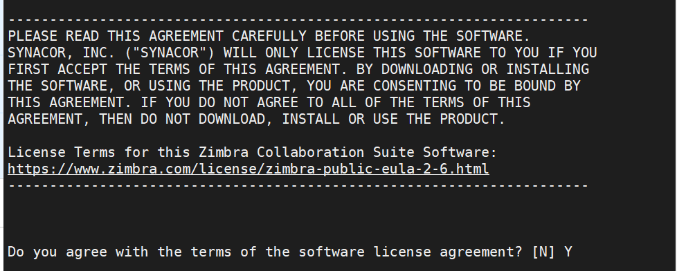
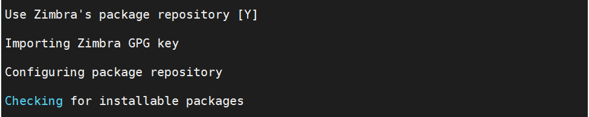
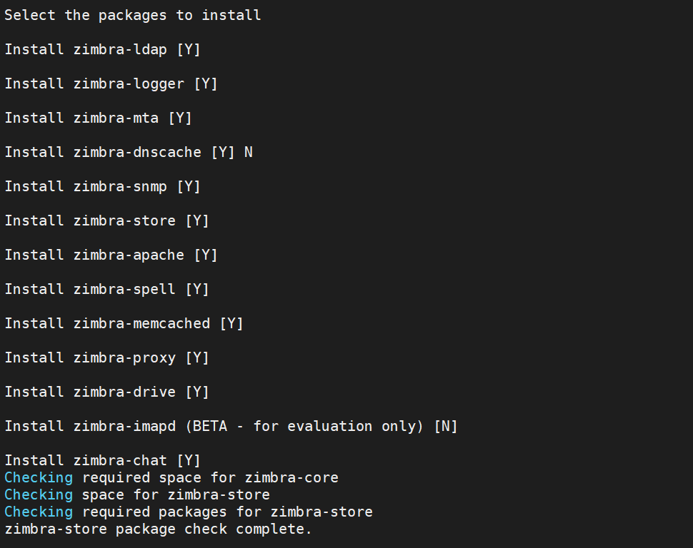
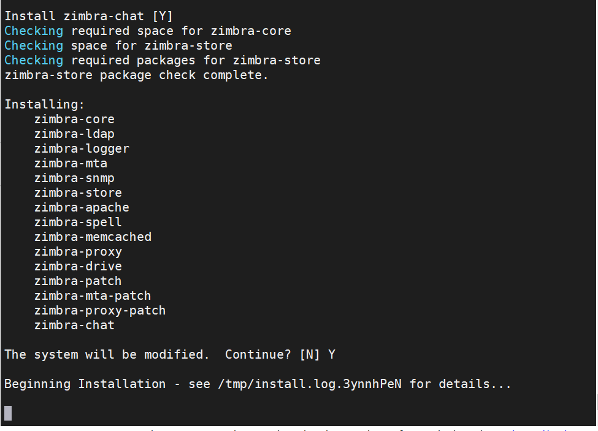

# Zimbra

* https://kienthuc.pavietnam.vn/article/Email-Server/Huong-dan-Thu-thuat/DMARC-la-gi?-Tai-sao-DMARC-lai-quan-trong-doi-voi-Mail-Server?.html
* 
## Giới thiệu
Các tính năng chính:
* Thư điện tử
* Lịch
* Sổ địa chỉ
* Danh mục Công việc(task cá nhân, nhóm)
* Tài liệu dưới dạng wiki
* Chat
* CLient desktop hoặc web
* Hỗ trợ điện thoại
* Nhiều Zimlet (tương tự như extension)

## Chuẩn bị 
1 server hoặc VPS có các cấu hình:
* 8GB RAM
* 10Gb Disk
* Có 1 IP public
* Có 1 tên miền

Đầu tiên là cấu hình tên miền:
* Thêm bản ghi A: Tên mail loại bản ghi A giá trị là IP
* Thêm bản ghi MX: Tên @ loại bản ghi MX giá trị mail.domain.com.vn
* Bản ghi DMARC: là một tiêu chuẩn để chặn spammer của của người sở hữu mà không được sự cho phép của họ mà ta hay gọi nó là spoofing. DMARC sẽ đảm bảo những mail giả mạo này sẽ bị chặn trước khi chúng đến được mailbox của những mail hợp lệ được chấp nhận vào hệ thống
    * Thêm bản ghi **_dmarc**: **_dmarc** loại bản ghi **txt** giá trị `v=DMARC1; p=none; rua=mailto:mailauth-reports@mail.domain.com.vn`
* Bản ghi SPF: là một cách thức để xác nhận một email server có được phép gửi email dưới tên một domain nào đó không. Chẳng hạn như muốn email từ user@domain.com.vn chỉ có giá trị khi gửi từ địa chỉ IP 1.1.1.1, còn các mail server khác có IP khác mà gửi các mail có đuôi @domain.com.vn đều là giả mạo và không được phép thì SPF sẽ thực hiện điều này. Khi đó mail server phía nhận sẽ loại bỏ tự động các email dưới dạng @domain.com.vn từ các địa chỉ không phải 1.1.1.1

### Định cấu hình tên máy chủ hệ thống
Điều đầu tiên chúng ta phải là là đặt tên máy chủ FQDN trỏ đến địa chỉ IP của máy chủ của bạn.

Để đặt tên cho máy chủ:
```
hostnamectl set-hostname mail.domain.com.vn
```
Thêm IP vào vào file hosts:
* Sửa file:
```
vi /etc/hosts
```
* Sau đó thêm dòng sau, để nguyên những dòng khác
```
<ip-address> mail.domain.com.vn mail
```
hoặc thực hiện lệnh:
```

hostnamectl set-hostname songhong.com.vn
echo "
103.139.103.218 songhong.com.vn mail
" >>/etc/hosts 
```

## Cài đặt
* Update.
```
yum install epel-release -y
yum update -y
```

* Thiết lập Firewall và một số package cơ bản, tắt selinux và khởi động lại:
```
sudo systemctl stop firewalld
sed -i 's/SELINUX=enforcing/SELINUX=disabled/g' /etc/sysconfig/selinux
sed -i 's/SELINUX=enforcing/SELINUX=disabled/g' /etc/selinux/config
yum install -y git  byobu bind-utils unzip net-tools sysstat openssh-clients perl-core libaio nmap-ncat libstdc++.so.6 nano wget
```

* Tải Zimbra v8.8.15 [tại đây](https://zimbra.org/download/zimbra-collaboration)

```
wget https://files.zimbra.com/downloads/8.8.15_GA/zcs-8.8.15_GA_3869.RHEL7_64.20190918004220.tgz
tar -xvf zcs-8.8.15_GA_3869.RHEL7_64.20190918004220.tgz
cd zcs-8.8.15_GA_3869.RHEL7_64.20190918004220
./install.sh
```





Gõ "Y" để sửa đổi hệ thống. Bây giờ nó sẽ bắt đầu tải xuống các gói liên quan đến Zimbra.
```
The system will be modified.  Continue? [N] Y
```



Sau khi tất cả các gói được cài đặt hoàn tất

Cần đặt tên miền chính xác sau khi gặp lỗi DNS.
```
DNS ERROR resolving MX for mail.domain.com.vn
It is suggested that the domain name have an MX record configured in DNS
Change domain name? [Yes] Yes
Create domain: [mail.domain.com.vn] domain.com.vn
```

Đặt mật khẩu quản trị:
```Checking for port conflicts

Main menu

   1) Common Configuration:
   2) zimbra-ldap:                             Enabled
   3) zimbra-logger:                           Enabled
   4) zimbra-mta:                              Enabled
   5) zimbra-snmp:                             Enabled
   6) zimbra-store:                            Enabled
        +Create Admin User:                    yes
        +Admin user to create:                 admin@domain.com.vn
******* +Admin Password                        UNSET
        +Anti-virus quarantine user:           virus-quarantine.qlfkigckcu@domain.com.vn
        +Enable automated spam training:       yes
        +Spam training user:                   spam.jmwydz7bo@domain.com.vn
        +Non-spam(Ham) training user:          ham.hiws9wyjzw@domain.com.vn
        +SMTP host:                            mail.domain.com.vn
        +Web server HTTP port:                 8080
        +Web server HTTPS port:                8443
        +Web server mode:                      https
        +IMAP server port:                     7143
        +IMAP server SSL port:                 7993
        +POP server port:                      7110
        +POP server SSL port:                  7995
        +Use spell check server:               yes
        +Spell server URL:                     http://mail.domain.com.vn:7780/aspell.php
        +Enable version update checks:         TRUE
        +Enable version update notifications:  TRUE
        +Version update notification email:    admin@domain.com.vn
        +Version update source email:          admin@domain.com.vn
        +Install mailstore (service webapp):   yes
        +Install UI (zimbra,zimbraAdmin webapps): yes                          

   7) zimbra-spell:                            Enabled
   8) zimbra-proxy:                            Enabled
   9) Default Class of Service Configuration:
   s) Save config to file
   x) Expand menu
   q) Quit

Address unconfigured (**) items  (? - help) 6

Store configuration

   1) Status:                                  Enabled
   2) Create Admin User:                       yes
   3) Admin user to create:                    admin@domain.com.vn
** 4) Admin Password                           UNSET
   5) Anti-virus quarantine user:              virus-quarantine.qlfkigckcu@domain.com.vn
   6) Enable automated spam training:          yes
   7) Spam training user:                      spam.jmwydz7bo@domain.com.vn
   8) Non-spam(Ham) training user:             ham.hiws9wyjzw@domain.com.vn
   9) SMTP host:                               mail.domain.com.vn
  10) Web server HTTP port:                    8080
  11) Web server HTTPS port:                   8443
  12) Web server mode:                         https
  13) IMAP server port:                        7143
  14) IMAP server SSL port:                    7993
  15) POP server port:                         7110
  16) POP server SSL port:                     7995
  17) Use spell check server:                  yes
  18) Spell server URL:                        http://mail.domain.com.vn:7780/aspell.php
  19) Enable version update checks:            TRUE
  20) Enable version update notifications:     TRUE
  21) Version update notification email:       admin@domain.com.vn
  22) Version update source email:             admin@domain.com.vn
  23) Install mailstore (service webapp):      yes
  24) Install UI (zimbra,zimbraAdmin webapps): yes

Select, or 'r' for previous menu [r] 4

Password for admin@songhong.com.vn (min 6 characters): [o41v9ntZb9] Duonghuy@@98

```

Tiếp theo ấn r để quay lại Menu
Tiếp theo ấn a để áp dụng thay đổi.
```
*** CONFIGURATION COMPLETE - press 'a' to apply
Select from menu, or press 'a' to apply config (? - help) a
Save configuration data to a file? [Yes] Yes
Save config in file: [/opt/zimbra/config.8708]
Saving config in /opt/zimbra/config.8708...done.
The system will be modified - continue? [No] Yes
```
Chờ quá trình hoàn tất.

Cho Zimbra thông báo về
```
Notify Zimbra of your installation? [Yes]
Notifying Zimbra of installation via http://www.zimbra.com/cgi-bin/notify.cgi?VER=8.8.15_GA_3869_RHEL7_64&MAIL=admin@domain.com.vn

Notification complete
```

Hoàn tất quá trình cài đặt Zimbra:
```
Checking if the NG started running...done.
Setting up zimbra crontab...done.


Moving /tmp/zmsetup.20210625-145016.log to /opt/zimbra/log


Configuration complete - press return to exit

```
Kiểm tra cuối cùng

Một bước cuối cùng sẽ là kiểm tra xem các dịch vụ Zimbra có đang chạy hay không 
```
cd ..
sudo su - zimbra
zmcontrol status
```
```
[root@mail ~]# cd ..
[root@mail /]# sudo su - zimbra
Last login: Fri Jun 25 15:50:10 +07 2021 on pts/0

[zimbra@mail ~]$ zmcontrol status
Host mail.domain.com.vn
        amavis                  Running
        antispam                Running
        antivirus               Running
        ldap                    Running
        logger                  Running
        mailbox                 Running
        memcached               Running
        mta                     Running
        opendkim                Running
        proxy                   Running
        service webapp          Running
        snmp                    Running
        spell                   Running
        stats                   Running
        zimbra webapp           Running
        zimbraAdmin webapp      Running
        zimlet webapp           Running
        zmconfigd               Running
```
Các dịch vụ của Zimbra đã hoạt động.

## Truy cập Zimbra Admin Portal & Web Mail Client
Để truy cập Cổng thông tin quản trị Zimbra, hãy truy cập vào Url sau: 
```
https: // <mail.domain.com.vn>:7071 / hoặc https: // <ip-address>:7071
```
firewall-cmd --zone=public --add-port=7071/tcp --permanent
firewall-cmd --zone=public --add-port=80/tcp --permanent
firewall-cmd --reload

<!-- 


 -->
